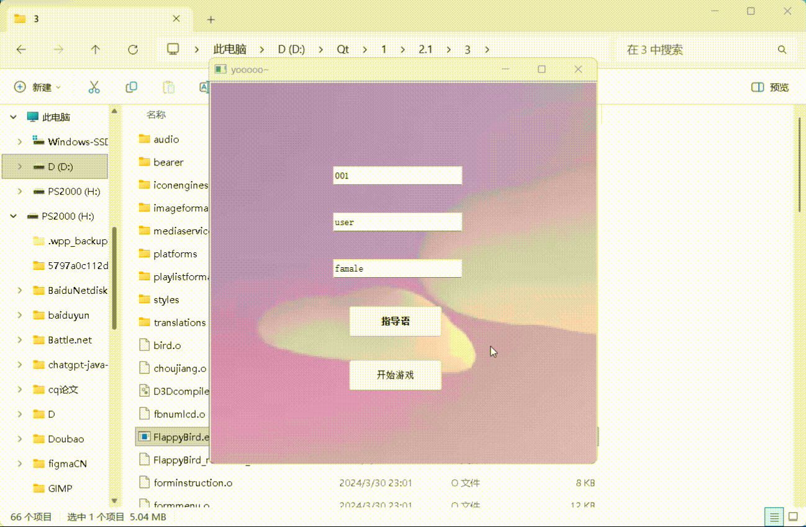

# 实验二 · 稀有价值相对低组（Loot Box 抽卡实验程序）
# Study 2 · Low-Value Rare-Reward Condition (Loot Box experiment program)

[← 返回仓库首页 / Back to repository root](../README.md)

| 项目 Item | 内容 |
|---|---|
| 实验 Study | 实验二（想要动机 wanting motivation） |
| 条件 Condition | 稀有奖励价值相对**低** / rare reward value **low** |
| 自变量 IV | 稀有奖励价值（高 / 低） |
| 因变量 DV | 抽奖次数、游戏时长、通过管道总数 |
| 稀有奖励 Rare reward | 每抽到 1 张稀有卡额外增加 **0.5 元** 被试费 |
| 中文组名 | 实验二 · 稀有价值相对低组（低价值组） |
| Qt 模块 | `core` `gui` `widgets` `multimedia` |

---

## 简体中文

### 这个程序是什么

本工程是论文实验二中「**稀有价值相对低组（低价值组）**」的完整实验程序。
奖池中包含两类卡片：

- **普通卡**：普通小熊图片（本组 84 张普通图片内容相同，即抽到普通卡时视觉结果一致）；
- **稀有卡**：**带金色边框**的小熊图片（`Images/S1/S3/S4.png`）。

每抽到一次稀有卡，在原本基础被试费上**额外增加 0.5 元**。指导语中对该组的描述为：

> 奖池内包含**普通奖**和**神秘大奖**，普通奖为正常的小熊图片，
> 神秘大奖为带有金色边框的小熊图片，神秘大奖抽中可获得 **0.5元现金**。

### 组别关键设置

| 位置 | 内容 |
|---|---|
| `shuoming.ui` | 奖池说明文案中的稀有奖励为 **`0.5元现金`**（这是与高价值组的**唯一差异文件**） |
| `choujiang.cpp` | 奖池含 3 张稀有卡 `S1/S3/S4.png`；`int XXX = 0;` 统计稀有卡；`if(XXX>2) index = 1;` 为稀有卡数量上限保护；按卡片类型分派 `emit_pingfen1..3`（稀有）/ `emit_pingfen4..10`（普通） |
| `Images/` | `A36/A60/A84.png` 位置被金色边框稀有卡替换；`S1…S5.png` 内容相同 |

### 编译与运行

```bash
# 用 Qt Creator 直接打开 FlappyBird.pro，或：
qmake FlappyBird.pro
make            # Windows + MinGW 使用 mingw32-make
```

环境：Qt 5.12+（原始实验为 Qt 5.15.2 / MinGW 8.1 32-bit / Windows），需要 `multimedia` 模块。

### 实验流程

1. 主试分配被试编号 → 打开本程序；
2. 被试在开始界面输入编号；
3. 阅读指导语（奖池说明会告知神秘大奖 = 0.5 元）→ 开始游戏；
4. 每通过 **3 个管道**获得 **1 次**抽奖机会；
5. 在商店抽奖（有放回抽取，每次概率相同）；
6. 每次抽奖结果出现后弹出 1–7 点"想要"程度评分框（稀有卡会额外触发稀有奖励提示）；
7. 被试自行决定结束时机 → 程序把 `TOTALSCORE`、`CJNUM` 追加写入 `testee.txt`。

### 数据输出

```text
TOTALSCORE:12,  CJNUM:9
```

字段含义与解析示例见 [../docs/DATA_FORMAT.md](../docs/DATA_FORMAT.md)。
如需在输出中增加稀有卡数量（`XXX`）、通过管道总数或游戏时长，可按该文档第 2 节的示例扩展写出语句。

### 目录结构

```text
E2-Low-Value-Rare/
├── FlappyBird.pro          # qmake 工程
├── main.cpp                # 程序入口
├── mainwindow.*            # 游戏主窗口（改造自上游 Flappy Bird）
├── formmenu.*              # 被试编号录入 / 开始界面
├── forminstruction.*       # 指导语
├── choujiang.*             # 抽奖核心逻辑（含稀有卡判定）  ← 实验二改造点
├── shuoming.*              # 奖池说明页（0.5 元）          ← 组别差异点
├── pingfen.*               # 1–7 点"想要"评分框
├── Module/                 # bird / ground / pipe / scoreboard / fbnumLCD / redyboard
├── Images/  sounds/        # 资源（含金色边框稀有卡 S1/S3/S4）
├── flappy.qrc              # Qt 资源清单
└── testee.txt              # 行为数据输出（结束后追加）
```

### 注意事项

- 若运行时报缺少 `Qt5Core.dll` / `Qt5Multimedia.dll`，请把 `Qt/5.15.x/mingw81_32/bin` 加入 `PATH`，
  或执行 `windeployqt FlappyBird.exe`；
- 数据文件写在**程序当前工作目录**，建议为每名被试单独建目录运行。

### 演示 Demo



---

## English

### What this program is

This project is the complete implementation of the **Low-Value** rare-reward condition of Study 2.
The draw pool contains two card types:

- **common cards** — ordinary bear images (in this group all 84 common images are identical, so common draws look the same);
- **rare cards** — bears with a **gold border** (`Images/S1/S3/S4.png`).

Each rare card adds **CNY 0.5** on top of the participant's base compensation. The on-screen description reads:

> 奖池内包含**普通奖**和**神秘大奖**…神秘大奖抽中可获得 **0.5元现金**。
> ("The pool contains a *common prize* and a *mystery grand prize* … the mystery prize pays **CNY 0.5**.")

### Key condition settings

| Location | Content |
|---|---|
| `shuoming.ui` | rare reward text is **`0.5元现金`** (this is the **only file** that differs from the High-Value group) |
| `choujiang.cpp` | pool includes three rare cards `S1/S3/S4.png`; `int XXX = 0;` counts rare cards; `if(XXX>2) index = 1;` caps them; card type dispatches `emit_pingfen1..3` (rare) / `emit_pingfen4..10` (common) |
| `Images/` | `A36/A60/A84.png` are replaced by gold-bordered rare cards; `S1…S5.png` are identical |

### Build and run

```bash
# open FlappyBird.pro in Qt Creator, or:
qmake FlappyBird.pro
make            # mingw32-make on Windows + MinGW
```

Requirements: Qt 5.12+ (the original study used Qt 5.15.2 / MinGW 8.1 32-bit / Windows) with the `multimedia` module.

### Procedure

1. The experimenter assigns a participant ID and launches this program.
2. The participant enters the ID on the start screen.
3. Instructions are shown (the pool page states the mystery prize = CNY 0.5), then the game starts.
4. Every **3 pipes passed** grants **1 draw credit**.
5. Draw in the shop (with replacement, equal probability each time).
6. A 1–7 "wanting" dialog follows each draw (rare cards additionally trigger the rare-reward prompt).
7. The participant ends the session whenever they like — `TOTALSCORE` and `CJNUM` are appended to `testee.txt`.

### Data output

```text
TOTALSCORE:12,  CJNUM:9
```

See [../docs/DATA_FORMAT.md](../docs/DATA_FORMAT.md) for field meanings and a parsing example.
To add the number of rare cards drawn (`XXX`), total pipes or play duration to the output, follow the
extension example in section 2 of that document.

### Demo


### Notes

- If `Qt5Core.dll` / `Qt5Multimedia.dll` is missing, add `Qt/5.15.x/mingw81_32/bin` to `PATH` or run `windeployqt FlappyBird.exe`.
- `testee.txt` is written to the program's **current working directory**; run each participant in a separate folder.
