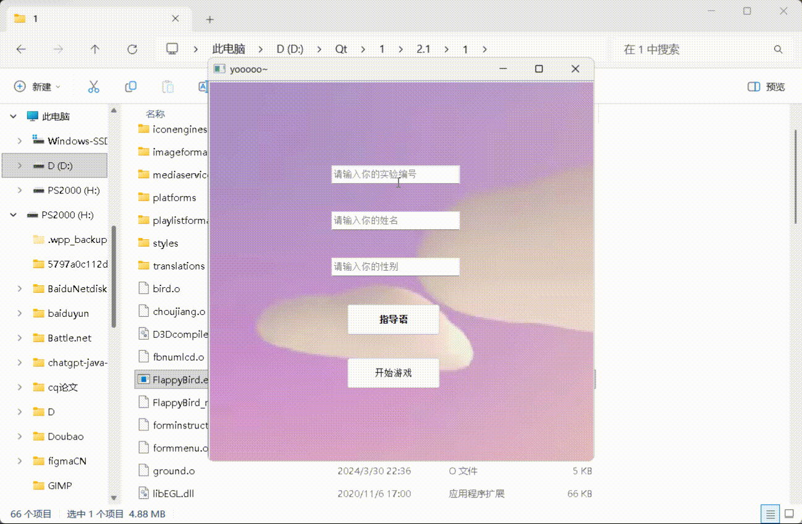
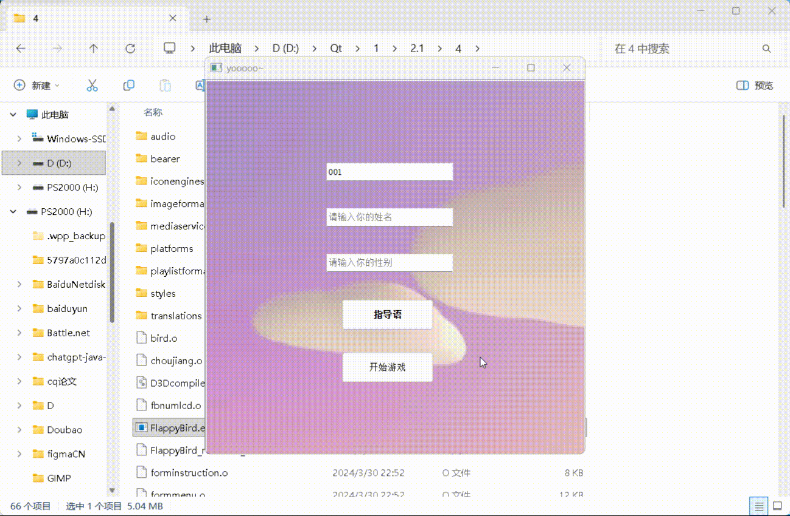

# Loot Box 抽卡实验程序集 · Loot Box Experiment Programs

> 基于 Qt 5 的 Flappy Bird 抽卡（Loot Box）行为实验程序 —— 四个实验条件版本
> A Qt 5 implementation of the Flappy Bird + loot-box drawing task used in a behavioural study — four experimental conditions.

[](https://www.qt.io/)
[]()
[](LICENSE)

---

## 目录 · Table of Contents

- [简体中文](#简体中文)
  - [项目简介](#项目简介)
  - [实验流程](#实验流程)
  - [四个实验条件](#四个实验条件)
  - [实验演示 Demo](#实验演示-demo)
  - [目录结构](#目录结构)
  - [编译与运行](#编译与运行)
  - [数据输出](#数据输出)
  - [每个程序内部改了什么](#每个程序内部改了什么)
  - [反思与改进](#反思与改进)
  - [引用](#引用)
- [English](#english)
  - [Overview](#overview)
  - [The four conditions](#the-four-conditions)
  - [Demo recordings](#demo-recordings)
  - [Repository layout](#repository-layout)
  - [Build and run](#build-and-run)
  - [Data output](#data-output)
  - [What differs between the programs](#what-differs-between-the-programs)
  - [Reflections and future improvements](#reflections-and-future-improvements)
  - [Citation](#citation)
- [License / 许可证](#license--许可证)

---

## 简体中文

### 项目简介

本仓库包含一篇本科毕业论文所使用的 **四个 Qt 实验程序完整源码**。程序把经典游戏《像素小鸟》(Flappy Bird) 与一个**抽卡/开箱 (Loot Box) 系统**结合在一起：

- 被试操作小鸟通过管道获得抽奖机会；
- 在"商店"里抽卡，抽卡结果为不同样式的小熊图片；
- 程序在后台记录**抽奖次数、通过管道总数、游戏时长**等客观行为指标；
- 抽卡后弹出 1–7 点评分框，测量被试对抽到结果的"想要"程度。

论文题目：《Loot Box 游戏中游戏动机对游戏行为的影响》（作者：史晏榕，西南大学心理学部）。
论文包含两个实验：**实验一**操纵"抽奖奖励是否随机"（好奇动机），**实验二**操纵"稀有奖励的价值高低"（想要动机）。四个程序分别对应这四个实验条件。

### 实验流程
1. 主试按被试顺序分配编号，打开该编号对应的**相应**实验程序；
2. 被试在开始界面输入编号；
3. 阅读指导语（告诉被试是为了测评一款游戏；会提示"每通过 3 个管道可获得一次抽奖机会"，且强调被试可以随时退出游戏，以测量其行为坚持度）；
4. 游玩 Flappy Bird：小鸟每通过 1 个管道得 1 分，**累计通过 3 个管道 = 1 次抽奖机会**；
5. 进入商店抽奖，抽取方式为**有放回抽取**，每次概率相同；
6. 每次抽奖结果出现后随机弹出 1–7 点"想要"评分框；
7. 被试可自行决定继续游戏或结束实验；
8. 结束后程序把行为数据写入 `testee.txt`，并弹出致谢提示。

### 四个实验条件

| 目录 | 中文组名 | 实验 | 自变量水平 | 抽取机制 | 备注 |
|---|---|---|---|---|---|
| [`E1-Fixed-Reward`](E1-Fixed-Reward/) | 实验一 · 奖励固定组 | 实验一（N=58） | 抽奖结果奖励**固定** | 奖池中 84 张小熊图片**完全相同**，无论抽到哪张看到的都是同一只小熊 | 好奇动机 / 低不确定 |
| [`E1-Random-Reward`](E1-Random-Reward/) | 实验一 · 奖励随机组 | 实验一（N=58） | 抽奖结果奖励**随机** | 奖池中 84 张小熊图片**各不相同**，每次抽到的样式都不同 | 好奇动机 / 高不确定 |
| [`E2-Low-Value-Rare`](E2-Low-Value-Rare/) | 实验二 · 稀有价值相对低组 | 实验二（N=62） | 稀有奖励价值**低** | 奖池 = 普通小熊 + 金色边框稀有卡；每抽到 1 张稀有卡额外奖励 **0.5 元** | 想要动机 / 低价值 |
| [`E2-High-Value-Rare`](E2-High-Value-Rare/) | 实验二 · 稀有价值相对高组 | 实验二（N=62） | 稀有奖励价值**高** | 同上，但每抽到 1 张稀有卡额外奖励 **3 元** | 想要动机 / 高价值 |

四个版本共用同一套 Flappy Bird 玩法与问卷框架，差异集中在抽奖系统的奖池构成与说明文案上，详见 [docs/EXPERIMENT_MAPPING.md](docs/EXPERIMENT_MAPPING.md) 与 [docs/MODIFICATIONS.md](docs/MODIFICATIONS.md)。

### 实验演示 Demo

| 条件 Condition | 演示 Demo |
|---|---|
| 实验一 · 奖励固定组 |  |
| 实验一 · 奖励随机组 |  |
| 实验二 · 稀有价值相对低组（0.5 元） |  |
| 实验二 · 稀有价值相对高组（3 元） |  |

### 目录结构

```text
lootbox-flappybird/
├── README.md                  # 本文件（中英双语）
├── LICENSE                    # MIT
├── CITATION.cff               # 引用信息
├── .gitignore / .gitattributes
├── docs/
│   ├── EXPERIMENT_MAPPING.md  # 论文 ↔ 四个程序 ↔ 组别的映射依据
│   ├── DATA_FORMAT.md         # 输出数据文件格式
│   ├── MODIFICATIONS.md       # 相对上游 FlappyBird 的改动说明
│   ├── REPO_DESCRIPTION.md    # 仓库 About 描述 / Topics / Release 文案
│   ├── zh/QUICKSTART.md       # 主试操作指南（实验流程、数据收集、常见问题）
│   └── demo/                  # README 中四段演示的 GIF 文件
├── E1-Fixed-Reward/           # 实验一 · 奖励固定组（完整 Qt 工程）
├── E1-Random-Reward/          # 实验一 · 奖励随机组（完整 Qt 工程）
├── E2-Low-Value-Rare/         # 实验二 · 稀有价值相对低组（完整 Qt 工程）
└── E2-High-Value-Rare/        # 实验二 · 稀有价值相对高组（完整 Qt 工程）
```

每个实验目录都是一个**可独立编译的 Qt 工程**，包含：

```text
E1-Fixed-Reward/
├── FlappyBird.pro     # qmake 工程文件
├── main.cpp mainwindow.*        # 程序入口与主窗口
├── formmenu.*                   # 被试编号录入 / 开始界面
├── forminstruction.*            # 指导语
├── choujiang.*                  # 抽奖（Loot Box）核心逻辑  ← 组间关键差异
├── shuoming.*                   # 奖池说明页               ← 组间关键差异
├── pingfen.*                    # 1–7 点"想要"评分框
├── Module/                      # 小鸟、地面、管道、记分板、LCD 数字、准备板
├── Images/  sounds/             # 图片与音效资源
├── flappy.qrc                   # Qt 资源清单
├── testee.txt                   # 行为数据输出（结束后追加）
└── README.md                    # 该组别的说明
```

### 编译与运行

**环境要求**

| 项目 | 要求 |
|---|---|
| Qt | 5.12 或更高（原始实验在 **Qt 5.15.2 / MinGW 8.1 32-bit / Windows** 下编译） |
| Qt 模块 | `core` `gui` `widgets` `multimedia` |
| 编译器 | MinGW 8.1（Windows）或任意 C++11 及以上编译器 |

**方式一：Qt Creator（推荐）**

1. 用 Qt Creator 打开对应组别目录下的 `FlappyBird.pro`；
2. 选择 Qt 5.15.x 的 Desktop kit；
3. 点击 *Build* → *Run*。

**方式二：命令行（qmake）**

```bash
cd E1-Fixed-Reward
qmake FlappyBird.pro
make            # Windows + MinGW 用 mingw32-make
```

> **Windows 下想让 exe 带图标**：把 `FlappyBird.pro` 中的 `# RC_ICONS = bird.ico` 一行取消注释后重新构建。
> 运行时若提示缺少 `Qt5Core.dll` 等，请把 `Qt/5.15.x/mingw81_32/bin` 加入 `PATH`，或使用 `windeployqt FlappyBird.exe`。

### 数据输出

程序在被试点击"结束实验"后，以**追加**方式写入运行目录下的 `testee.txt`：

```text
TOTALSCORE:12,  CJNUM:9
```

| 字段 | 含义 |
|---|---|
| `TOTALSCORE` | 得分（管道计分，程序内为分数 / 2） |
| `CJNUM` | 被试实际完成的**抽奖次数** |

字段含义、解析示例，以及"通过管道总数""游戏时长"等指标的扩展方式见 [docs/DATA_FORMAT.md](docs/DATA_FORMAT.md)。

### 每个程序内部改了什么

四个目录是四个真实的实验条件版本，组间差异存在于源码与资源中：

- `E1-Fixed-Reward`：`Images/A1.png … A84.png` 84 个文件内容完全相同 → 抽奖结果恒定；
- `E1-Random-Reward`：同样 84 个文件内容各不相同 → 每次抽到不同样式；
- `E2-*`：`choujiang.cpp` 的奖池额外包含 `S1/S3/S4.png` 三张金色边框稀有卡，并在抽中稀有卡时触发额外的评分与奖励逻辑；
- `E2-Low-Value-Rare` 与 `E2-High-Value-Rare`：两者游戏与抽奖代码相同，区别在 `shuoming.ui` 中的稀有奖励金额（`0.5元现金` / `三元现金`）。

完整清单见 [docs/MODIFICATIONS.md](docs/MODIFICATIONS.md)。


### 反思与改进

> **Keywords**: `Loot Box` · `Random Reward` · `Problem Gambling` · `Loss Chasing` · `Incentive Salience` · `Wanting / Liking`

---

#### 1. 核心玩法与开箱机制的动机解耦 (Dissociating Core Gameplay vs. Loot Box Motivation)
* **现存局限**：实验以动作敏捷任务（像素小鸟）作为获取开箱资格的门槛，导致“玩小鸟”既可能是获取抽奖的**工具性手段（Instrumental Means）**，也可能是被试追求的**内在目标（Intrinsic Goal）**。仅以宏观总时长和总抽卡数作为指标，无法完全剥离是玩法本身的心流还是开箱的不确定性主导了行为坚持度。
* **机制意义**：若无法解耦核心玩法与开箱机制，便难以估计 Loot Box 随机奖励机制对行为粘性的独立贡献，也难以判断其与问题性赌博共享的强化机制。
* **改进方案**：
  * **试次级（Trial-level）微观行为采集**：精确记录每轮次通关耗时、失误重试潜伏期（Latency）、抽卡界面停留时长、抽卡后继续下一轮的延迟及退出前总轮次。
  * **变量属性的统计区分**：将单次耗时与抽卡停留时间作为**过程变量或中介变量**；将基线游戏表现、冲动性、感觉寻求（Sensation Seeking）、FOMO、收藏倾向等实验前测稳定特质作为**协变量（Covariates）**。
  * **混合效应模型与净效应估计**：采用广义线性混合模型（GLMM)拟合试次级的重复测量数据（如继续决策与抽取频次），在控制个体基线差异与核心玩法干扰的前提下，精准量化开箱机制对行为坚持度的独立贡献。

---

#### 2. 奖励刺激的生态效度与实验控制的权衡 (Ecological Validity vs. Experimental Control)
* **现存局限**：为严格控制物理低级属性，实验采用了简笔画作为奖励刺激。虽然保证了内部效度，但生态效度较低，可能低估了真实游戏中稀有资产所激发的渴望（Craving）与唤醒水平。
* **机制意义**：商业游戏中的稀有战利品深度绑定了身份认同、社交炫耀、审美偏好以及二手市场经济价值，这些是诱发“想要动机（Wanting）”的关键驱动力。
* **改进方案**：
  * **拟真资产与预实验评定**：采用高质量拟真虚拟资产（如使用 Blender/Unity 自制，避免直接使用商业版权素材），并在正式实验前对刺激物进行标准化评定，涵盖主观价值、稀有度、欲望度、审美偏好与唤醒度。
  * **操作有效性检验**：在预实验中严格检验高/低价值操纵的组间主观差异显著性，防范正式实验中出现操纵失效。
  * **外生变量平衡**：通过前测筛选、匹配设计与后测协变量控制，剥离被试先前游戏经验、市场价值认知与审美偏好带来的外生干扰。
  * **分离稀有性与现实价值**：增设“无现实经济价值的稀有卡条件”，探究纯粹的“概率稀缺性”与“外在现实价值”对决策行为的独立与交互影响。

---

#### 3. 博彩机制维度的拓展：从纯收益框架到损益与微交易模拟 (Expanding into Gambling Mechanisms)
* **现存局限**：当前实验基于被试费加成的“纯收益框架”，缺乏初始代币消耗、抽卡成本与本金损失风险，尚未完全触及赌博障碍的核心心理机制。
* **机制意义**：真实的赌博与 Loot Box 消费往往涉及微交易（Micro-transactions）、沉没成本效应（Sunk Cost Effect）与损失追逐（Loss Chasing）。若只研究“收益—抽卡”，便难以与赌博障碍的强化机制形成直接对话。
* **改进方案**：
  * **损益框架与损失追逐**：引入初始代币消耗与负反馈机制，系统考察个体在经历代币净损失后的冲动加注与滞留行为。
  * **随机强化与近失效应（Near-miss Effect）**：操纵“差一点抽到顶级稀有卡”的界面反馈，检验近失事件对下一次开箱潜伏期与动机强度的即时促进效应。
  * **机制透明度与保底系统（Pity Mechanics）**：对比公开概率 vs. 隐藏概率、硬保底 vs. 无保底条件下的决策差异与控制幻觉（Illusion of Control）；严格匹配每抽成本与期望收益，避免概率结构变化混淆结果。
  * **微交易模拟与伦理边界**：实验全流程采用虚拟代币模拟，杜绝真实金钱赌博；严格遵循 IRB 伦理规范，设置充分的知情同意、成瘾风险提示与随时无条件退出机制，避免诱导现实问题赌博倾向。

---

#### 4. 多模态生理与神经指标的融合 (Cognitive Neuroscience Approach)
* **现存局限**：当前研究完全依赖行为数据与自陈量表，难以揭示奖赏预测误差（RPE）的毫秒级演变，且无法直接分离动机诱发中的神经生物学动态。
* **改进方案**：
  * **眼动追踪（Eye-Tracking）**：量化被试对开箱动画、稀有卡视觉线索及概率声明的注视偏向与瞳孔放大效应（认知唤醒）；实验中严格校准光照条件与瞳孔基线。
  * **皮电活动（EDA）**：记录开箱前期待期（Anticipation）与结果揭晓期的交感神经激活程度；严控动作伪迹与个体基线电导差异。
  * **脑电 ERP 探索**：聚焦反映奖赏预测误差与结果评价的负向/正向电位成分（FRN / RewP），以及表征注意分配与动机显著性（Incentive Salience）的 P300 成分；保证硬件级时间同步标记与伪迹剔除。
  * **多模态整合**：将行为数据、眼动轨迹、EDA、ERP 与主观量表深度拟合，形成闭环交叉验证链。

---

### 引用

```bibtex
@thesis{shi2024lootbox,
  author = {史晏榕 (SHI Yanrong)},
  title  = {Loot Box 游戏中游戏动机对游戏行为的影响},
  type   = {本科毕业论文},
  school = {西南大学 心理学部},
  year   = {2024}
}
```

若本仓库对你的研究有帮助，欢迎引用；也请同时引用本仓库（见 [CITATION.cff](CITATION.cff)）。


---

## English

### Overview

This repository contains the **complete Qt source code of the four experimental programs** used in an undergraduate thesis at Southwest University (Faculty of Psychology). Each program combines a classic **Flappy Bird** game with a **loot-box card-drawing system**:

- participants fly the bird through pipes to earn draw credits;
- they spend credits in a "shop" to draw cards (different bear images);
- the program logs objective behavioural measures (**number of draws, pipes passed, time played**);
- after every draw a 1–7 rating dialog measures the participant's **wanting** for the obtained item.

Thesis title: *Loot Box 游戏中游戏动机对游戏行为的影响* ("The Impact of Game Motivation on Game Behavior in Loot Box Games").
**Study 1** manipulates whether the draw reward is *fixed* or *random* (curiosity motivation); **Study 2** manipulates the *value* of the rare reward (wanting motivation). The four folders correspond one-to-one to the four conditions.

### The four conditions

| Folder | Condition (Chinese group name) | Study | IV level | Draw mechanism | Note |
|---|---|---|---|---|---|
| [`E1-Fixed-Reward`](E1-Fixed-Reward/) | 实验一 · 奖励固定组 (fixed reward) | 1 (N=58) | reward **fixed** | all 84 bear images in the pool are **byte-identical** — every draw looks the same | low uncertainty |
| [`E1-Random-Reward`](E1-Random-Reward/) | 实验一 · 奖励随机组 (random reward) | 1 (N=58) | reward **random** | the 84 bear images are **all different** — every draw looks new | high uncertainty |
| [`E2-Low-Value-Rare`](E2-Low-Value-Rare/) | 实验二 · 稀有价值相对低组 (low-value rare) | 2 (N=62) | rare value **low** | pool = common bears + gold-bordered rare cards; each rare card pays **CNY 0.5** extra | low wanting |
| [`E2-High-Value-Rare`](E2-High-Value-Rare/) | 实验二 · 稀有价值相对高组 (high-value rare) | 2 (N=62) | rare value **high** | same, but each rare card pays **CNY 3** extra | high wanting |

All four share the same Flappy Bird gameplay and questionnaire shell; they differ in the draw pool and in the instruction text. See [docs/EXPERIMENT_MAPPING.md](docs/EXPERIMENT_MAPPING.md) and [docs/MODIFICATIONS.md](docs/MODIFICATIONS.md).

### Demo recordings

| Condition | Demo |
|---|---|
| Study 1 · Fixed reward |  |
| Study 1 · Random reward |  |
| Study 2 · Low-value rare |  |
| Study 2 · High-value rare |  |

### Repository layout

```text
lootbox-flappybird/
├── README.md                  # this file (bilingual)
├── LICENSE                    # MIT
├── CITATION.cff
├── docs/
│   ├── EXPERIMENT_MAPPING.md  # how each folder was matched to a thesis condition
│   ├── DATA_FORMAT.md         # output data format
│   ├── MODIFICATIONS.md       # changes relative to the upstream FlappyBird project
│   ├── REPO_DESCRIPTION.md    # About description / topics / release copy
│   ├── zh/QUICKSTART.md       # experimenter quick start (Chinese)
│   └── demo/                  # the four demo GIFs used above
├── E1-Fixed-Reward/           # complete, self-contained Qt project
├── E1-Random-Reward/
├── E2-Low-Value-Rare/
└── E2-High-Value-Rare/
```

Each condition folder is an independent Qt project containing `FlappyBird.pro`, the game logic (`mainwindow.*`, `Module/`), the experiment shell (`formmenu.*`, `forminstruction.*`), the loot-box logic (`choujiang.*`), the pool description page (`shuoming.*`), the 1–7 rating dialog (`pingfen.*`), plus `Images/`, `sounds/`, `flappy.qrc` and the `testee.txt` output file.

### Build and run

**Requirements**

| Item | Requirement |
|---|---|
| Qt | 5.12+ (the original study was built with **Qt 5.15.2 / MinGW 8.1 32-bit / Windows**) |
| Qt modules | `core` `gui` `widgets` `multimedia` |
| Compiler | MinGW 8.1 (Windows) or any C++11-or-newer compiler |

**Option A — Qt Creator (recommended)**

1. Open `FlappyBird.pro` from the condition folder you need;
2. Select a Qt 5.15.x desktop kit;
3. *Build* → *Run*.

**Option B — command line (qmake)**

```bash
cd E2-Low-Value-Rare
qmake FlappyBird.pro
make            # use mingw32-make on Windows + MinGW
```

> On Windows, uncomment the `# RC_ICONS = bird.ico` line in `FlappyBird.pro` to embed the executable icon.
> If `Qt5Core.dll` is missing at runtime, add `Qt/5.15.x/mingw81_32/bin` to `PATH` or run `windeployqt FlappyBird.exe`.

### Experimental procedure

1. The experimenter assigns each participant an ID and launches the matching program.
2. The participant enters their ID on the start screen.
3. Instructions are shown (The instructions state that the task is to evaluate a game, mention that “pass 3 pipes to earn one draw” and emphasize that the participant may quit the game at any time in order to measure their behavioral persistence.).
4. Flappy Bird: 1 point per pipe passed; **every 3 pipes = 1 draw credit**.
5. Draw in the shop — sampling is **with replacement**, every draw has the same probability.
6. After each draw a 1–7 "wanting" rating dialog appears.
7. The participant may keep playing or end the experiment at any time.
8. On exit the program appends the behavioural data to `testee.txt` and shows a thank-you dialog.

### Data output

On "end experiment" the program **appends** one line to `testee.txt` in the working directory:

```text
TOTALSCORE:12,  CJNUM:9
```

| Field | Meaning |
|---|---|
| `TOTALSCORE` | score (pipe score; stored as score / 2) |
| `CJNUM` | number of draws actually completed |

See [docs/DATA_FORMAT.md](docs/DATA_FORMAT.md) for field details, a parsing example, and how to extend the output with total pipes and play duration.

### What differs between the programs

The four folders are four real condition builds; the manipulation lives in the sources and assets:

- `E1-Fixed-Reward`: `Images/A1.png … A84.png` are 84 byte-identical copies → the drawn reward is constant;
- `E1-Random-Reward`: the same 84 files are all distinct → every draw differs;
- `E2-*`: `choujiang.cpp` extends the pool with three gold-bordered rare cards (`S1/S3/S4.png`) and triggers the extra rating/reward logic when a rare card is drawn;
- `E2-Low-Value-Rare` and `E2-High-Value-Rare`: identical game and draw code, differing only in the rare-reward amount in `shuoming.ui` (`0.5元现金` vs `3元现金`).

Full list: [docs/MODIFICATIONS.md](docs/MODIFICATIONS.md).

### Reflections and future improvements

> **Keywords**: `Loot Box` · `Random Reward Mechanisms` · `Problem Gambling` · `Loss Chasing` · `Incentive Salience` · `Wanting vs. Liking`

---

#### 1. Dissociating Core Gameplay vs. Loot-Box Motivation
* **Current Limitations**: The current design used a simple action-agility task (*Flappy Bird*-like) as the access threshold to earn loot-box draws. Consequently, engaging in the core gameplay could serve either as an **instrumental means** to acquire reward draws or as an **intrinsic goal** pursued for its own sake. Relying exclusively on macro-level behavioral metrics (total playtime and total draw count) makes it difficult to disentangle whether behavioral persistence was primarily driven by the flow state induced by core gameplay or by the curiosity and wanting elicited by reward uncertainty.
* **Mechanistic Significance**: Without decoupling core gameplay motivation from loot-box engagement, it is challenging to quantify the independent contribution of random reward schedules to behavioral persistence, or to evaluate the reinforcement mechanisms it shares with problem gambling.
* **Proposed Improvements**:
  * **Trial-Level Micro-Behavioral Tracking**: Systematically log per-trial completion latency, post-error retry latency, loot-box interface dwell time, latency to initiate subsequent trials post-draw, and total completed rounds prior to voluntary session termination.
  * **Assigning Statistical Roles to Variables**: Treat per-trial completion time and interface dwell time as **process or mediating variables**; incorporate stable pre-test traits—such as baseline motor performance, trait impulsivity, sensation seeking, Fear of Missing Out (FOMO), and collection tendencies—as **covariates**.
  * **Mixed-Effects Modeling & Net Effect Estimation**: Fit **Generalized Linear Mixed Models (GLMMs)** to trial-level repeated-measures data (e.g., binary continuation decisions and draw counts) to statistically isolate the net contribution of loot-box mechanics to behavioral persistence after controlling for core gameplay performance and individual baseline differences.

---

#### 2. Ecological Validity vs. Experimental Control of Reward Stimuli
* **Current Limitations**: To maintain strict experimental control over low-level visual and physical properties, simplistic line drawings were used as reward stimuli. While this ensured high internal validity, the low ecological validity may have attenuated subjective craving, arousal, and incentive salience compared to rewards encountered in commercial gaming environments.
* **Mechanistic Significance**: In commercial games, rare loot is deeply intertwined with social status, identity display, aesthetic value, and secondary-market economic value—key drivers that elicit strong "wanting" motivation.
* **Proposed Improvements**:
  * **High-Fidelity Virtual Assets & Pilot Validation**: Develop bespoke, high-fidelity 2D/3D virtual assets (e.g., via Blender/Unity to avoid copyright constraints), accompanied by standardized pre-experimental pilot ratings assessing subjective value, perceived rarity, desirability, aesthetic preference, and emotional arousal.
  * **Manipulation Checks**: Conduct rigorous statistical checks during pilot phases to verify significant subjective separation between high- and low-value reward tiers, preventing manipulation failure in the primary experiment.
  * **Balancing Extraneous Variables**: Control for confounding influences stemming from prior gaming background, perceived market value, and subjective aesthetic preferences using pre-screening, matched-group designs, and post-test covariate adjustments.
  * **Isolating Probabilistic Rarity from Extrinsic Value**: Introduce a "zero-real-world-value rare reward" condition to experimentally dissociate the independent and interactive effects of pure probabilistic rarity versus external economic value on decision-making.

---

#### 3. Expanding into Gambling Mechanisms: From Gain Frames to Loss and Micro-Transaction Simulations
* **Current Limitations**: The current paradigm relies strictly on an additive "pure-gain framework" (performance-contingent bonus compensation), lacking initial token endowments, per-draw costs, and downside financial risks. As such, it does not fully model the core behavioral dynamics of gambling disorder.
* **Mechanistic Significance**: Real-world loot-box engagement and problem gambling center on micro-transactions, sunk cost effects, and loss chasing. Investigating loot boxes solely under a reward-gain paradigm limits direct dialogue with clinical models of gambling reinforcement.
* **Proposed Improvements**:
  * **Gain-Loss Framing & Loss Chasing**: Introduce initial token endowments and negative financial/token feedback loops to systematically examine post-loss escalation, impulsive replenishment, and persistence.
  * **Random Reinforcement & Near-Miss Effects**: Manipulate visual outcome feedback to simulate "near-miss" events (e.g., stopping adjacent to top-tier rare items) to test their immediate facilitating effects on motivation and subsequent draw latency.
  * **Odds Transparency & Pity Mechanics**: Contrast decision-making and illusions of control under disclosed versus hidden odds, as well as guaranteed-drop ("pity") versus no-pity schedules, while strictly calibrating unit costs and expected values across conditions.
  * **Simulated Micro-Transactions & Ethical Boundaries**: Use experimental tokens exclusively, completely avoiding real-money gambling. Adhere strictly to institutional review board (IRB) ethical guidelines by implementing comprehensive informed consent, problem-gambling risk disclosures, and unrestricted voluntary withdrawal mechanisms.

---

#### 4. Multimodal Physiological and Neural Integration (Cognitive Neuroscience Approach)
* **Current Limitations**: The present study relies entirely on macro-behavioral outputs and retrospective self-reports, obscuring the millisecond-level temporal dynamics of reward prediction errors (RPE) and precluding the neurobiological dissociation of motivational wanting from hedonic liking.
* **Proposed Improvements**:
  * **Eye-Tracking**: Quantify attentional bias, fixation durations, and pupillary dilation (indexing cognitive/autonomic arousal) toward unboxing animations, rare reward cues, and odds disclosures, while rigorously controlling for luminance and baseline pupil diameter.
  * **Electrodermal Activity (EDA)**: Measure sympathetic nervous system arousal during both the anticipation and outcome-revelation phases, implementing strict controls for movement artifacts and individual baseline conductance differences.
  * **Event-Related Potentials (ERP)**: Target electrophysiological markers, including the Feedback-Related Negativity / Reward Positivity (FRN / RewP) reflecting reward prediction errors and outcome appraisal, and the P300 component indexing attentional resource allocation and incentive salience, supported by hardware-synchronized event tagging.
  * **Multimodal Convergence**: Integrate trial-level behavioral dynamics, gaze metrics, autonomic signals, ERP components, and psychometric scales into a coherent, cross-validating empirical framework.
  * *Note*: Electrophysiological indices should be conservatively framed as exploratory neural correlates rather than definitive biomarkers of wanting/liking dissociation.

### Citation

```bibtex
@thesis{shi2024lootbox,
  author = {SHI Yanrong (史晏榕)},
  title  = {The Impact of Game Motivation on Game Behavior in Loot Box Games},
  type   = {Undergraduate thesis},
  school = {Southwest University, Faculty of Psychology},
  year   = {2024}
}
```

If this repository helps your research, please cite the thesis above and this repository (see [CITATION.cff](CITATION.cff)).


---

## License / 许可证

代码以 [MIT License](LICENSE) 发布（仅覆盖本仓库的**源代码**）。

- 上游 Flappy Bird 教学项目（`QtFlappyBird-master`）的原始著作权归其作者所有；
- `Images/`、`sounds/` 等游戏素材沿用上游来源，其中「小熊 / 金色边框」抽卡图片与问卷界面为**本实验自行制作**；
- 论文文本与问卷题目（如网络游戏成瘾量表、loot box 游戏动机问卷）**不在**本许可证覆盖范围内，如需使用请联系论文作者。

The source code is released under the [MIT License](LICENSE).

- The upstream teaching project (`QtFlappyBird-master`) and its original assets remain the property of their respective authors.
- The loot-box assets (bear images, gold-bordered rare cards) and experiment UI were created for this study.
- The thesis text and questionnaire items (e.g. the Internet Gaming Disorder scale and the loot-box motivation questionnaire) are **not** covered by this license — please contact the author for reuse.
